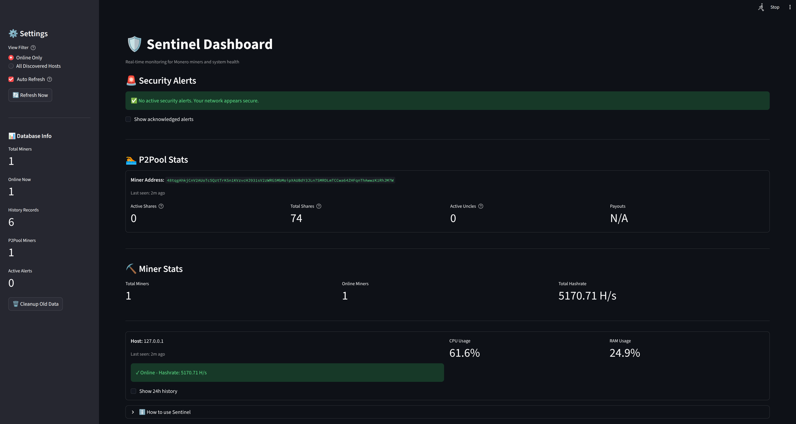

# 🛡️ Sentinel - Monero Miner Monitoring System



A comprehensive monitoring solution for Monero miners with local SQLite storage, P2Pool integration, and a beautiful Streamlit dashboard.

## ✨ Features

- **Local Database Storage**: All data stored in SQLite (no cloud dependencies)
- **Real-time Monitoring**: Track hashrate, CPU, and RAM usage
- **P2Pool Integration**: Monitor shares, payouts, and pool stats
- **Network Scanning**: Discover miners across your network
- **Historical Data**: Track performance over time with automatic cleanup
- **Beautiful Dashboard**: Real-time Streamlit interface with charts
- **NIDS Support**: Optional network intrusion detection

## 📋 Requirements

- Python 3.8+
- Monero miner with API enabled
- (Optional) P2Pool miner for pool stats
- (Optional) Scapy for NIDS functionality

## 🚀 Quick Start

### 1. Installation

```bash
# Install dependencies
pip install -r requirements.txt

# Optional: For NIDS functionality
pip install scapy
```

### 2. Configuration

Edit `config.py` to customize:

```python
# Change your miner API token
MINER_API_TOKEN = "your_token_here"

# Adjust data retention
DATA_RETENTION_DAYS = 30

# Modify dashboard refresh rate
DASHBOARD_REFRESH_INTERVAL = 30
```

### 3. Monitor Your Local Miner

```bash
python probe.py --host 127.0.0.1
```

### 4. Launch the Dashboard

```bash
streamlit run app.py
```

Visit `http://localhost:8501` in your browser!

## 📖 Usage Guide

### Basic Monitoring

Monitor a single miner:
```bash
python probe.py --host 192.168.1.100
```

Monitor with custom port:
```bash
python probe.py --host 192.168.1.100 --port 8080
```

### Network Scanning

Scan entire subnet:
```bash
python probe.py --scan 192.168.1.0/24
```

Scan with custom port:
```bash
python probe.py --scan 192.168.1.0/24 --port 8080
```

### P2Pool Monitoring

Monitor P2Pool stats:
```bash
python probe.py --host 127.0.0.1 \
  --p2pool-miner-address YOUR_MONERO_ADDRESS \
  --p2pool-network main
```

Available networks: `main`, `mini`, `nano`

### Database Maintenance

View database statistics:
```bash
python probe.py --stats
```

Cleanup old data (older than configured retention period):
```bash
python probe.py --cleanup
```

### NIDS Mode (Requires Root)

Run network intrusion detection:
```bash
sudo python probe.py --nids --iface eth0
```

## 🤖 Automation

### Using Cron (Linux/macOS)

Edit your crontab:
```bash
crontab -e
```

Add entries for periodic monitoring:
```bash
# Monitor local miner every 5 minutes
*/5 * * * * /usr/bin/python3 /path/to/probe.py --host 127.0.0.1

# Scan network once per hour
0 * * * * /usr/bin/python3 /path/to/probe.py --scan 192.168.1.0/24

# Cleanup old data daily at 3 AM
0 3 * * * /usr/bin/python3 /path/to/probe.py --cleanup
```

### Using systemd (Linux)

Create a service file `/etc/systemd/system/sentinel-probe.service`:
```ini
[Unit]
Description=Sentinel Miner Monitoring
After=network.target

[Service]
Type=oneshot
User=your_username
WorkingDirectory=/path/to/sentinel
ExecStart=/usr/bin/python3 probe.py --host 127.0.0.1

[Install]
WantedBy=multi-user.target
```

Create a timer `/etc/systemd/system/sentinel-probe.timer`:
```ini
[Unit]
Description=Run Sentinel Probe every 5 minutes

[Timer]
OnBootSec=1min
OnUnitActiveSec=5min

[Install]
WantedBy=timers.target
```

Enable and start:
```bash
sudo systemctl enable sentinel-probe.timer
sudo systemctl start sentinel-probe.timer
```

### Using Windows Task Scheduler

1. Open Task Scheduler
2. Create Basic Task
3. Trigger: Daily (or your preference)
4. Action: Start a program
   - Program: `python.exe`
   - Arguments: `C:\path\to\probe.py --host 127.0.0.1`
   - Start in: `C:\path\to\sentinel`

## 📊 Dashboard Features

The Streamlit dashboard provides:

- **Real-time Stats**: Live hashrate, CPU, RAM monitoring
- **Online/Offline Status**: Visual indicators for each miner
- **Historical Charts**: 24-hour performance graphs
- **P2Pool Integration**: Share counts, payouts, pool stats
- **Auto-refresh**: Configurable automatic updates
- **Filtering**: View only online miners or all discovered hosts
- **Database Info**: Quick stats and maintenance tools

### Dashboard Screenshots

The dashboard displays:
- Total hashrate across all miners
- Individual miner status cards
- CPU and RAM usage metrics
- P2Pool active shares and totals
- Historical performance charts

## 🗄️ Database Schema

### Miners Table
Stores current status of each miner:
- `host`: IP address or hostname
- `last_seen`: Last successful check
- `hashrate`: Current hashrate (H/s)
- `cpu_usage`: CPU percentage
- `ram_usage`: RAM percentage
- `status`: Online/Offline

### Miner History Table
Time-series data for historical analysis:
- All fields from miners table
- `timestamp`: When the measurement was taken

### P2Pool Stats Table
Current P2Pool statistics:
- `miner_address`: Monero wallet address
- `active_shares`: Shares in current window
- `total_shares`: All-time valid shares
- `active_uncles`: Uncle blocks in window
- Plus: blocks found, payouts, etc.

### P2Pool History Table
Historical P2Pool data for tracking progress.

## 🔧 Troubleshooting

### Miner Not Responding

1. Check if miner API is enabled
2. Verify the correct port (default: 8000)
3. Ensure the API token matches in `config.py`
4. Check firewall rules

### Database Errors

```bash
# Reset the database (WARNING: deletes all data)
rm sentinel.db
python probe.py --host 127.0.0.1
```

### Dashboard Won't Start

```bash
# Check if port 8501 is in use
netstat -an | grep 8501

# Use a different port
streamlit run app.py --server.port 8502
```

### Permission Denied (NIDS)

NIDS mode requires root privileges:
```bash
sudo python probe.py --nids --iface eth0
```

## 🔐 Security Considerations

- **API Tokens**: Store securely in `config.py`, don't commit to git
- **Network Scanning**: Only scan networks you own/manage
- **NIDS Mode**: Requires root, use with caution
- **Database Access**: Protect `sentinel.db` file permissions
- **Dashboard**: Consider adding authentication for production use

## 📝 Configuration Reference

### config.py Options

```python
# Database
DB_PATH = "sentinel.db"                    # Database file location

# Miner API
DEFAULT_MINER_PORT = 8000                  # Default miner API port
MINER_API_TOKEN = "your_token"             # API authentication token
MINER_API_TIMEOUT = 2                      # Request timeout (seconds)

# P2Pool
P2POOL_API_TIMEOUT = 5                     # P2Pool API timeout
P2POOL_WINDOW_SIZE = 2160                  # PPLNS window size

# Data Management
DATA_RETENTION_DAYS = 30                   # How long to keep history

# Dashboard
DASHBOARD_REFRESH_INTERVAL = 30            # Auto-refresh interval
DASHBOARD_PORT = 8501                      # Streamlit port
```

## 🤝 Contributing

Contributions welcome! Areas for improvement:
- Additional metrics (temperature, power usage)
- Email/SMS notifications for offline miners
- Multi-currency support beyond Monero
- Advanced anomaly detection
- Export to CSV/JSON features

## 📄 License

MIT License - See LICENSE file for details

## 🙏 Acknowledgments

- Built with Streamlit, SQLite, and Python
- P2Pool stats from p2pool.observer API
- Inspired by the need for simple, local miner monitoring

## 📞 Support

For issues, questions, or suggestions:
- Open an issue on GitHub
- Check existing documentation
- Review troubleshooting section

---

**Happy Mining! ⛏️**
